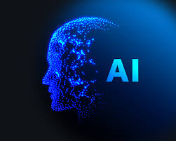

## Is AI a crutch or an enhancement to learning?

  For ICS 314 I have used ChatGPT a couple of times. I have always thought it to be somewhat of a cheat; it encourages us to use less of our own intelligence when solving problems. However, as we progressed in the course I found that AI can be very helpful in aiding software engineering. I found that it can be used somewhat like a search engine to find answers to manageable/simple questions where you can then use your own critical thinking to put together those pieces in order to solve a bigger issue. Overall, I found AI not to be a cheat or a crutch, but an enhancement to my learning experience with software engineering.

## My experience with AI Frameworks

Experience WODs e.g. E18:

I used AI probably once for the experience WODs, and when I did I believe I asked it a question such as, "how do I change the padding of a div in react." This wasn't a very good question to ask and instead I looked at past modules to find my answer. 

In-class Practice WODs:

I did not use AI for these as I thought it was manageable to find an answer on my own via our previous class materials.

In-class WODs:

I used AI once for the Underscore WOD. I asked ChatGPT "what underscore function could return an average for an array of values" and it showed me which one I could use. I then asked it a more specific question asking it "how to use that function in my specific situation (after giving it context of the names of the objects and variables involved)." In this case AI was very useful and I learned that AI, or ChatGPT, can be extremely helpful in aiding with coding if you give it manageable, bitesize questions and then ask it to piece together those bites into a complete "meal."

Essays:

I did not use AI for any essays since I like to write and prefer my writing to come from me.

Final project:

I did not use AI for the final project yet as I think finding the answer on my own is very doable given the amount of time we have to work on the final project.

Learning a concept / tutorial:

I did not use AI for this since the tutorials were very straightforward.

Answering a question in class or in Discord:

I did not use AI for this because I think that things like this should be put in our own words and thoughts.

Asking or answering a smart-question:

I did not use AI for this because I think that things like this should also be put in our own words or thoughts.

Coding example e.g. “give an example of using Underscore .pluck”:

As I mentioned earlier, I used AI/ChatGPT to help with coding Underscore functions in one of the WODs. I explained how it helped and why I did so in the previous paragaphs.

Explaining code:

I did not use AI for this yet mainly because I hadn't thought of this. Although this may be a helpful thing to do in the near future.

Writing code:

As I mentioned earlier, I used AI/ChatGPT to help with coding Underscore functions.

Documenting code:

I did not use AI for this yet mainly because I hadn't thought of this. Although I do think it could a useful thing to do in the future.

Quality assurance:

I did not use AI for this because I like to figure these things out on my own.

## Impact on learning

  To be honest, I didn't use AI all that much in this class but I learned from the few times I did use it. I learned that it can be useful as a way to learn about concepts. I also found it extremely helpful with aiding coding. It can't always fully grasp the context of your code, but if you ask it questions in a way where context isn't needed you can take its answer and apply it to your code. This has been helpful in the few times that I've used AI to aid my coding experiences.

## Practical uses

  AI definitely has a lot of practical uses. I have a lot of friends working in the software engineering industry and they use ChatGPT often to help them code and debug code. I also have used ChatGPT a lot in ICS 311 as it is very good at describing algorithms and choosing which ones are best to use in certain situations. I definitely think I will be using AI a lot once I start my career.

## Challenges and opportunities

  I don't believe AI has presented a lot of challenges in my learning in the field of software engineering. On the contrary, I think it presents a huge opportunity in future education in software engineering. For example, since it is such a powerful teaching tool, it can be helpful to learn how to use it effectively. Maybe in the future, this class could integrate a section on how to effectively ask ChatGPT questions that will provide usable results.

## Comparative analysis

  As I said in the previous paragraph, the use of AI in learning software engineering brings about a huge learning opportunity. However, I do think that although it is useful to use AI to learn about software engineering, maybe on timed assessments such as the WODs it shouldn't be allowed just because it hinders retention of material in my perspective. It encourages students to rely on it rather than their own understanding of topics.

## Future considerations

  In the future, the role of AI in software engineering education could be more refined. It should be emphasized that it is a powerful tool and students should be taught how to use it, but they should also be strictly told when it is advisable to use it and when it is not for certain assignments. This is because for certain assignments AI is certainly capable of allowing the student to do it for them and that hinders learning.

## Conclusion

  In conclusion, AI is an intriguing new tool that can turbocharge the learning of software engineering. However, with great power comes great responsibility. It must be used correctly. AI can do a lot of things, but it cannot think for you at the end of the day. You can't let AI do the thinking for you. You can let it teach you small concepts so that you can do the thinking on your own. Once you let AI think for you, it's almost as if you are giving it control. I believe that one day AI will take over the world because we will become to dependent on it. Luckily, today is not that day so let's use it to learn as much as we can while we still can!
