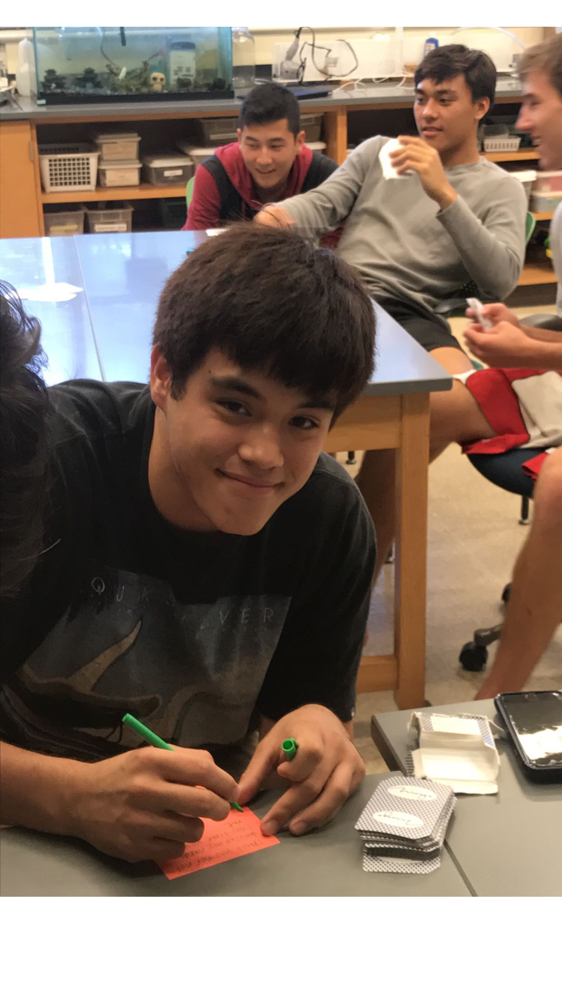
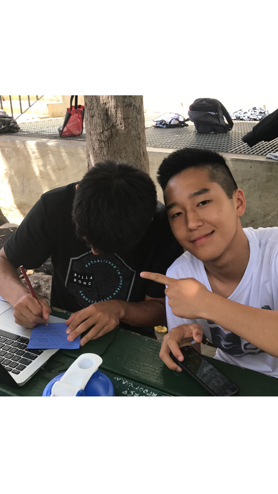

  
  
  
  

My club would meet to play various card games such as Trumps or Egyptian War and enjoy snacks that I would provide. The entrance fee would always be a short note of gratitude to a selected person in our community that we wanted to show appreciation for. An example of someone we wrote to was our beloved librarian Aunty Gabes, who was retiring. I had about 40 active participants in my club, so every time we wrote to someone they would get a decent amount of love and appreciation.

I ran the club from 2018 to 2019. Our mission was to combine our interest in cards cleverly with giving back to our community. I hope to do something similar to this again, as community service is definitely a passion of mine.
