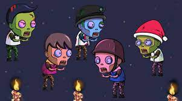
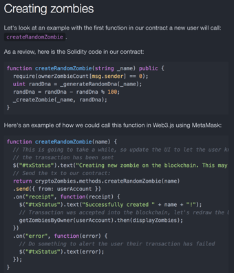

  
  

Crypto Zombies is a web course designed to help beginners learn Solidity, a coding language associated with smart contracts and cryptocurrency. You learn the basics of Solidity by creating zombies, each with their own unique set of DNA. It was interesting to learn about how each zombie is unique and different numbers in its DNA corresponded to different features of the zombie that would change its appearance. I intend to continue the course until I complete the advanced portion.

I enjoyed my time independently learning and coding. This individual project helped me train my brain to want to learn, even when the only person urgning me to is myself. I hope to keep up this level of discipline and focus for my next goal: I want to learn how to code with Swift, so that I can try to make an app to put on the App Store!

You can learn more at the [(https://cryptozombies.io/)].
